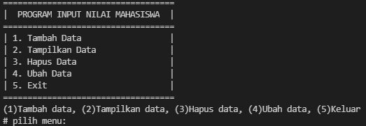

# Praktikum6
## Tugas Pertemuan 11 - Bahasa Pemrograman

### 1. File Latihan.py
Program ini adalah program latihan, yaitu Mengubah kode menjadi fungsi menggunakan *"lambda"*.

* **CODINGAN:**
```python
# Latihan 
# Mengubah kode menjadi fungsi menggunakan lambda
import math
def a(x):
    return x**2
    a = lambda x : x ** 2
print(a(2))

def b(x, y):
    return math.sqrt(x**2 + y**2)
    b = lambda x, y : x ** 2  + y ** 2
print(b(2, 2))

def c(*args):
    return sum(args)/len(args)
    c = lambda *args : sum(args)/len(args)
print(c(5, -6, 7, 8))

def d(s):
    return "".join(set(s))
    d = lambda s: "".join(set(s))
print(d("Raihan"))
```

* **Hasil output program:**


### 2. File Praktikum.py
```md
Program ini adalah program sederhana yang akan menampilkan daftar nilai mahasiswa, Program dibuat dengan mengaplikasikan penggunaan *"fungsi"* pada python, dengan ketentuan: 
* Fungsi **tambah()** untuk menambah data
* Fungsi **tampilkan()** untuk menampilkan data
* Fungsi **hapus()** untuk menghapus data berdasarkan nama
* Fungsi **ubah()** untuk mengubah data berdasarkan nama
```

* **CODINGAN**
```python
DataMahasiswa = {}

def judul():
    print("=" * 35)
    print("|  PROGRAM INPUT NILAI MAHASISWA  |")
    print("=" * 35)
    print('| 1. Tambah Data                  |')
    print('| 2. Tampilkan Data               |')
    print('| 3. Hapus Data                   |')
    print('| 4. Ubah Data                    |')
    print('| 5. Exit                         |')
    print("=" * 35)
    
judul()

def tambah():
        nama = str(input("\nMasukan Nama      \t: "))
        nim = int(input("Masukan Nim          \t: "))
        tugas = int(input("Masukan Nilai Tugas\t: "))
        uts = int(input("Masukan Nilai UTS\t: "))
        uas = int(input("Masukan Nilai UAS \t: "))
        akhir = (tugas*0.30 + uts*0.35 + uas*0.35)
        DataMahasiswa[nama] = nim, tugas, uts, uas, akhir,
        print("DATA BERHASIL DI TAMBAHKAN!")

def tampilkan():
        print("=" * 69)
        print("|" + "\t" * 3 + "DAFTAR NILAI MAHASISWA" + "\t" * 3 +
                  "    |")
        print("=" * 69)
        print("| NO |   \tNAMA\t   |\tNIM \t| TUGAS | UTS | UAS | AKHIR |")
        print("=" * 69)
        i = 0  
        for tampil in DataMahasiswa.items():
            i += 1
            print("| {6:2} |\t {0:15}   | {1:9} \t| {2:5} | {3:3} | {4:3} | {5:5} |".format(tampil[0], tampil[1][0], tampil[1][1], tampil[1][2], tampil[1][3],"%.2f" % float(tampil[1][4]), i))
            print("=" * 69)

def hapus(nama):
            del DataMahasiswa[nama]
            print("DATA BERHASIL DI HAPUS!")
 
def ubah(nama):
        if nama in DataMahasiswa.keys():
            nim = int(input("Masukan Nim          \t: "))
            tugas = int(input("Masukan Nilai Tugas\t: "))
            uts = int(input("Masukan Nilai UTS\t: "))
            uas = int(input("Masukan Nilai UAS \t: "))
            akhir = (tugas*0.30 + uts*0.35 + uas*0.35)
            DataMahasiswa[nama] = nim, tugas, uts, uas, akhir
            print("\nDATA BERHASIL DI UBAH!")
        else:
            print("\DATA TIDAK DI TEMUKAN!")

while True:
    data = input("(1)Tambah data, (2)Tampilkan data, (3)Hapus data, (4)Ubah data, (5)Keluar \n# pilih menu: ")
   
    if (data.lower() == '1'):
        tambah()

    elif (data.lower() == '4'):
        nama = str(input("\nMasukan Nama        \t: "))
        ubah(nama)
    elif (data.lower() == '3'):
        nama = str(input("\nMasukan Nama        \t: "))
        if nama in DataMahasiswa:
            hapus(nama)
        else:
            print("DATA TIDAK DI TEMUKAN ".format(nama))
    elif (data.lower() == '2'):
        if DataMahasiswa.items():
            tampilkan()
            print(" ")
        else:
            print("=" * 69)
            print("|" + "\t" * 3 + "DAFTAR NILAI MAHASISWA" + "\t" * 3 +
                  "    |")
            print("=" * 69)
            print("| NO |   \tNAMA\t   |\tNIM \t| TUGAS | UTS | UAS | AKHIR |")
            print("=" * 69)
            print("|    " + "\t" * 3 + "TIDAK ADA DATA!" + "\t" * 4 + "    |")
            print("=" * 69)
    elif (data.lower() == '5'):
        print("\nTHANK YOU :) \n")
        exit()
    else:
        print("PILIHAN MENU TIDAK ADA!")
```

* **Hasil output program:**

Hasil output Tampilan awal program


Hasil output ketika program menambahkan data


Hasil output ketika program menghapus data


Hasil output ketika program mengubah data


Hasil output ketika program diberhentikan


* **Flowchart:**

Berikut flowchart dari program data nilai mahasiswa.


* **Penjelasan program:**

1. Membuat  dictionary kosong yang nantinya akan berisikan data yaitu, berupa [nama] = nim, tugas, uts, uas, akhir.
	```python
    DataMahasiswa = {}
	```
2. Kodingan dibawah merupakan sebuah tabel program yang didalamnya terdapat menu. Jika ingin memanggil fungsinnya terlebih dahulu untuk mengenter dan kemudian memanggilnya dengan cara ketikan "judul()".
    ```python
    def judul():
    print("=" * 35)
    print("|  PROGRAM INPUT NILAI MAHASISWA  |")
    print("=" * 35)
    print('| 1. Tambah Data                  |')
    print('| 2. Tampilkan Data               |')
    print('| 3. Hapus Data                   |')
    print('| 4. Ubah Data                    |')
    print('| 5. Exit                         |')
    print("=" * 35)
    
judul()
    ```
3. Pada sebuah fungsi def tambah() yang berisikan dengan inputan nama, nim, tugas, uts, uas dan perhitungan nilai akhir yang akan di masukan ke directory DataMahasiswa. Dan untuk operator nilainya menggunakan aritmatika.
    ```python
    def tambah():
        nama = str(input("\nMasukan Nama      \t: "))
        nim = int(input("Masukan Nim          \t: "))
        tugas = int(input("Masukan Nilai Tugas\t: "))
        uts = int(input("Masukan Nilai UTS\t: "))
        uas = int(input("Masukan Nilai UAS \t: "))
        akhir = (tugas*0.30 + uts*0.35 + uas*0.35)
        DataMahasiswa[nama] = nim, tugas, uts, uas, akhir,
        print("DATA BERHASIL DI TAMBAHKAN!")
    ```
4. Kodingan dibawah adalah tabel yang menampilkan sebuah hasil dari penginputan program. Sedangkan ***for tampil in DataMahasiswa.items()*** adalah sebuah pengulangan yang ada pada Directory ***"DataMahasiswa"*** didalamnnya.
    ```python
    def tampilkan():
        print("=" * 69)
        print("|" + "\t" * 3 + "DAFTAR NILAI MAHASISWA" + "\t" * 3 +
                  "    |")
        print("=" * 69)
        print("| NO |   \tNAMA\t   |\tNIM \t| TUGAS | UTS | UAS | AKHIR |")
        print("=" * 69)
        i = 0  
        for tampil in DataMahasiswa.items():
            i += 1
            print("| {6:2} |\t {0:15}   | {1:9} \t| {2:5} | {3:3} | {4:3} | {5:5} |".format(tampil[0], tampil[1][0], tampil[1][1], tampil[1][2], tampil[1][3],"%.2f" % float(tampil[1][4]), i))
            print("=" * 69)
        ```
5. Kodingan ini digunakan untuk penghapusan sebuah data pada program yang sebelumnya telah diinput. Dan inputan dari kodingan ini berdasarkan ***"nama"*** yang sebelumnya telah diinput.
    ```python
    def hapus(nama):
            del DataMahasiswa[nama]
            print("DATA BERHASIL DI HAPUS!")
    ```

6. Fungsi def ubah(nama) berfungsi sebagai menu mengubah data yang telah diinput, Inputan tersebut diisi bersarkan nama, Sedangkan untuk penginputan sebuah nim, tugas, uts, dan uas dapat kita ubah sesuai kebutuhan.
    ```python
   def ubah(nama):
        if nama in DataMahasiswa.keys():
            nim = int(input("Masukan Nim          \t: "))
            tugas = int(input("Masukan Nilai Tugas\t: "))
            uts = int(input("Masukan Nilai UTS\t: "))
            uas = int(input("Masukan Nilai UAS \t: "))
            akhir = (tugas*0.30 + uts*0.35 + uas*0.35)
            DataMahasiswa[nama] = nim, tugas, uts, uas, akhir
            print("\nDATA BERHASIL DI UBAH!")
        else:
            print("\DATA TIDAK DI TEMUKAN!")
    ```
7. Kodingan ini merupakan sebuah perulangan pada suatu menu program menggunakan while true, Dan pernyataan While akan terus mengulangi pernyataan tersebut jika conditional expression bernilai 1 (TRUE).
    ```python
    while True:
    data = input("(1)Tambah data, (2)Tampilkan data, (3)Hapus data, (4)Ubah data, (5)Keluar \n# pilih menu: ")
    ```
8. Pada statment if, elif, else, di dalam while True yang nanti akan dipanggil dari masing masing fungsi, Berikut cara memanggil def fungsi yang telah dibuat sebelumnya:
    tambah()
    tampilkan()
    hapus(nama)
    ubah(nama)
    ```python
    if (data.lower() == '1'):
        tambah()

    elif (data.lower() == '4'):
        nama = str(input("\nMasukan Nama        \t: "))
        ubah(nama)
    elif (data.lower() == '3'):
        nama = str(input("\nMasukan Nama        \t: "))
        if nama in DataMahasiswa:
            hapus(nama)
        else:
            print("DATA TIDAK DI TEMUKAN ".format(nama))
    elif (data.lower() == '2'):
        if DataMahasiswa.items():
            tampilkan()
            print(" ")
        else:
            print("=" * 69)
            print("|" + "\t" * 3 + "DAFTAR NILAI MAHASISWA" + "\t" * 3 +
                  "    |")
            print("=" * 69)
            print("| NO |   \tNAMA\t   |\tNIM \t| TUGAS | UTS | UAS | AKHIR |")
            print("=" * 69)
            print("|    " + "\t" * 3 + "TIDAK ADA DATA!" + "\t" * 4 + "    |")
            print("=" * 69)
    ```
9. Jika data sudah selesai diinput, Pilih menu ke 5 yaitu "k"(Keluar), Maka program secara otomatis akan berhenti.
    ```python
    elif (data.lower() == '5'):
        print("\nTHANK YOU :) \n")
        exit()
    else:
        print("PILIHAN MENU TIDAK ADA!")
    ```